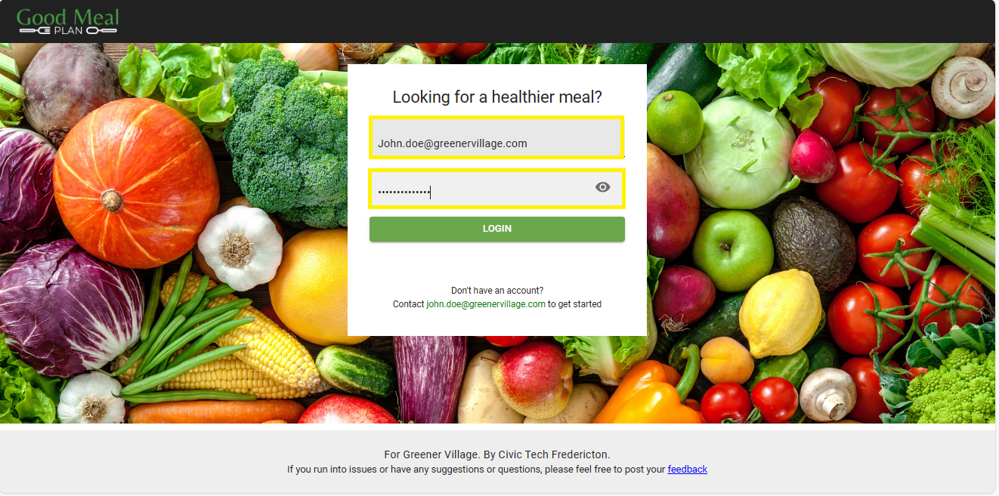

#Login To Mealplanner 

###Overview
The login page allows registered users to sign in to the Mealplanner application to view meals and create personalized meal plans.

**Usage**

1. **Accessing the Login Page**
    - Navigate to the GoodMealPlan website by typing the URL [https://goodmealplan.com/](https://goodmealplan.com/) in the web browser's address bar
    - The login page will load, and you'll need to enter your login information

2. **Logging In**
    - Enter your registered email address in the "Email" field
    - Enter your password in the "Password" field
    - Click on the (LOGIN) button to proceed

*Screenshot: Login Page*

###Additional Notes
- Ensure you are using a secure and trusted internet connection when entering your login credentials
- For security reasons, it is recommended to log out after each session, especially when using shared devices or public computers
- For any questions or assistance, please contact your administrator
