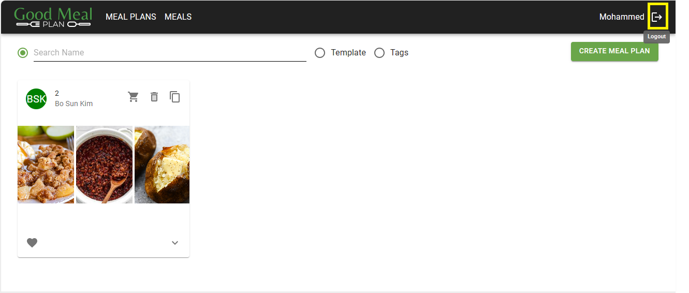

#Logout From Mealplanner 

###Overview
The logout functionality allows users to securely logout from the Mealplanner application, preventing unauthorized access to the application.

**Usage**

1. **Logging Out**

    - Ensure you are logged in to your account
    - Locate the (Logout) button to the right of the top of the page, beside the account name
    - Click on the (Logout) button to initiate the logout process

*Screenshot: Logout Page*
### Additional Notes
- Logging out is essential to protect your account from unauthorized access, especially when using shared devices or public computers
- After logging out, it is recommended to close the web browser or clear any saved login credentials for added security
- For any questions or assistance, please contact your administrator
