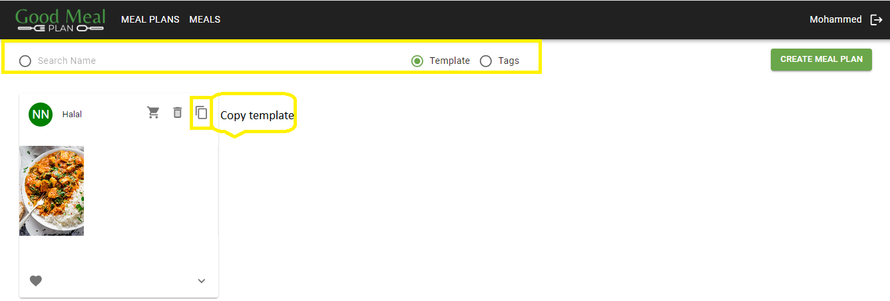
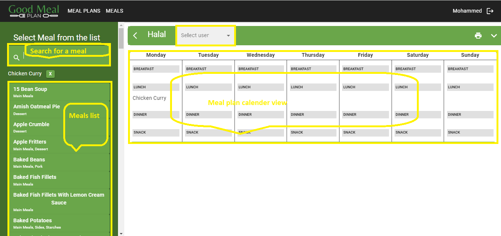

#Create a Meal Plan from a Template

###Overview
Creating a meal plan from a template allows users to quickly generate meal plans based on predefined meal templates. This documentation provides step-by-step instructions on how to create a meal plan from a template and assign it to a user.

**Usage**

1. **Navigate to the 'Meal Plans' Page**
    - Open your web browser and go to [GoodMealPlan](https://goodmealplan.com/#/mealplans)
    - If you're not already logged in, sign in to your account
    - Once logged in, you'll be directed to the meal plans page

2. **Selecting a Template to Copy**
    - Select a template from the available meal templates or use the search option to find a specific template
    - Choose the template you want to use as the basis for your meal plan
    - Click on the option to copy or duplicate the selected template
    - This action creates a new meal plan from the template that you can customize later on

*Screenshot: Copy a Template*
 
3. **Customize Meal Plan**
    - Navigate to the meal plans page
    -  Assign the meal plan to the intended user
    - Perform any modification to the  meal plan as required

 
*Screenshot: Customize Meal Plan*

### Additional Notes
For any questions or assistance, please contact your administrator