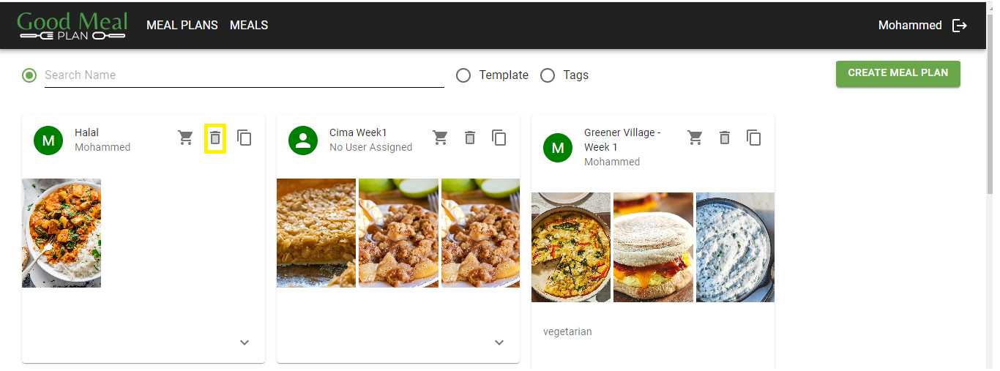

# Delete a Meal Plan

## Overview
This guide covers the steps to delete a meal plan that is no longer required.

**Usage**

1. **Navigate to the 'Meal Plans' Page**
    - Open your web browser and go to [GoodMealPlan](https://goodmealplan.com/#/mealplans)
    - If you're not already logged in, sign in to your account
    - Once logged in, you'll be directed to the 'Meal plans' page

2. **Find a Meal Plan to Delete**
    - In the "Meal Plans" page, select a meal plan from the available meal plans or use the search option to find a specific meal plan
    - Once you find the desired meal plan, click on the 'Trash Can' icon to delete this meal plan
    

*Screenshot: Delete a Meal Plan*

### Additional Notes
- For any questions or assistance, please contact your administrator
