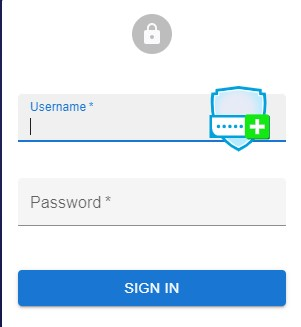
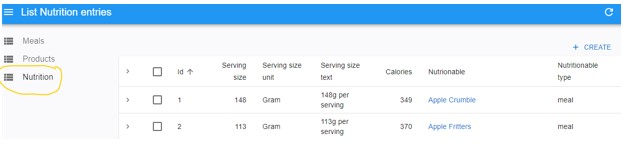
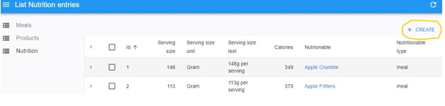
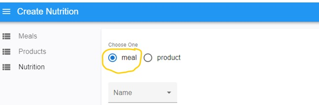
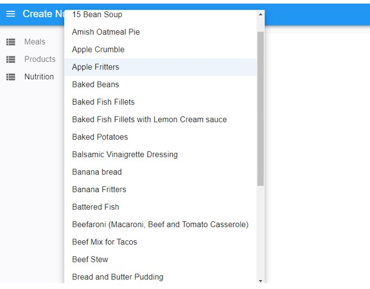
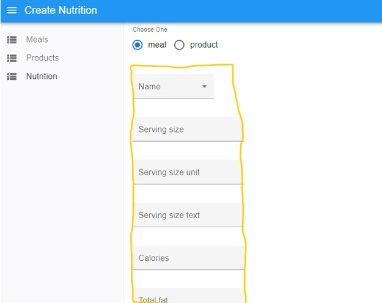
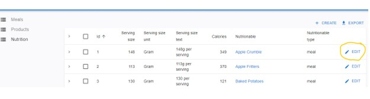

# Meal Planner Documentation

## Overview

## Step 1 
- Access the Admin UI with permissions (Username & Password) assigned as a meal designer.

## Step 2
- Click on “Nutrition Menu”

## Step 3
- Click on create

## Step 4
- Click on Meal Option

## Step 5 
- Verify that the meals visible when you click on Name drop dowm.

## Step 6
- Choose a meal and ensure its nutritional details are entered correctly below

## Step 7
- Verify from each meal's edit field that the food has its nutritional details inputted correctly.

###Additional Notes
- Ensure you are using a secure and trusted internet connection when entering your login credentials
- For security reasons, it is recommended to log out after each session, especially when using shared devices or public computers
- For any questions or assistance, please contact your administrator
