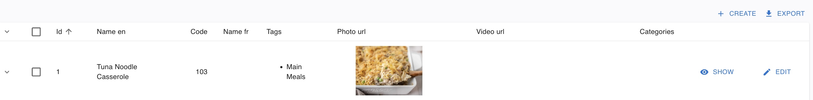
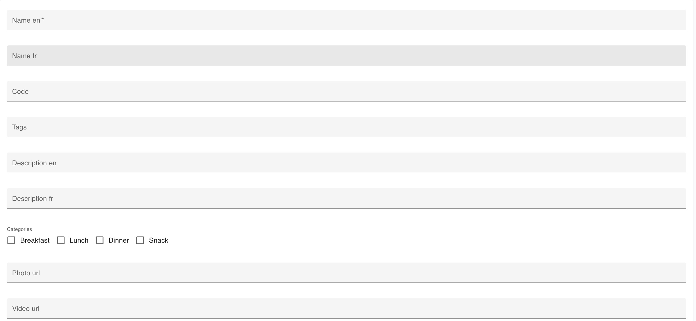
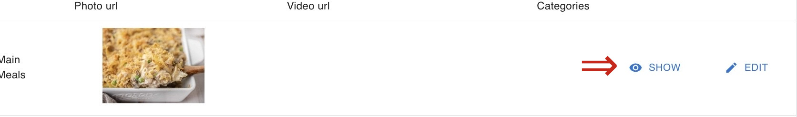
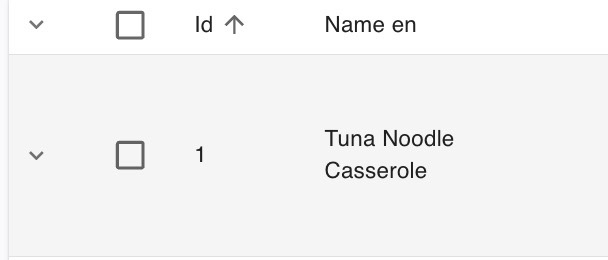
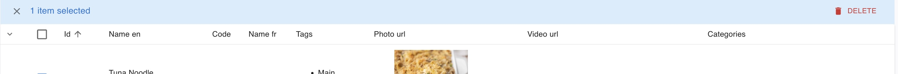

# MealPlanner (GoodMealPlan) Website Documentation

## Meals (Admin-Ui)

### 1.1 Creating a Meal

### Overview
Creating a meal allows Admins to create new meals/recipes, which the users can view or add to their meal plan. 
To create a meal, please follow the steps below:

**Steps to Create a Meal**

1. **Navigate to the Meal Admin Page**
    - Open your web browser and go to GoodMealPlan Admin URL
    - If you're not already logged in, sign in to your account
    - Once logged in, you'll be directed to the main page 
    - From left pane select "Meals". 

    Note: You must be an Admin to create a Meal.

2. **Click the Create button**
    - Click the `Create` button in the top right part of the admin-ui page. 
    
    

3. **Add the Meal details and Create the Meal**
	- Enter the Name of the meal in English or/and French.
	- Enter the Code for the meal.
	- Enter the necessary tags for the Meal.
	- Enter a relevant description for the meal in English or/and French.
	- Select the relevant Categories (Breakfast/Lunch/Dinner/Snack) for the Meal.
	- Enter a Photo and Video url or link for the meal.
	- Enter the relevant Cook time, Prep time for the meal.
	- Enter the Portions, Total cost, and the Serving cost for the meal.
	- Enter the serving size unit and Nutrition rating for the meal.
	- Enter the method description for the meal.
	- Enter any relevant Tips for the meal.
	- Click Save to Creat the Meal.

### 1.2 Viewing a Meal

### Overview
Viewing a meal allows admin to view the necessary details about the meal. 
To view a meal, please follow the steps below:

**Steps to View a Meal**

1. **Navigate to the Meal Plan Products Admin Page**
    - Open your web browser and go to GoodMealPlan Admin. 
    - If you're not already logged in, sign in to your account
    - Once logged in, you'll be directed to the new page from left pane select products list. 

2. **Select the Meal tab.**
    - Click on "Meals" on the top left sidebar of the admin-ui page. 

3. **Search for a meal by its name.**
    - On the Search column of the admin page for the MealPlanner app, search for the meal by its name.

4. **View the Meal**
	- Click the drop-down arrow.
	- Click the Show button to view the meal.
	- Click the necessary tabs (Method, Summary, and Nutrition) as needed to view those sections of a meal.

	
### 1.3 Editing a Meal

### Overview
Editing a meal allows the admin to change relevant specifications of a meal if needed. 
To edit a meal, please follow the steps below:

**Steps to View a Meal**

1. **Navigate to the Meal Plan Products Admin Page**
    - Open your web browser and go to GoodMealPlan Admin.
    - If you're not already logged in, sign in to your account
    - Once logged in, you'll be directed to the new page from left pane select "Products". 

2. **Select the Meal tab.**
    - Click on "Meals" on the top left sidebar of the admin-ui page. 
 

3. **Search for a meal by its name.**
    - On the Search column of the admin page for the MealPlanner app, search for the meal by its name.

4. **Edit the Meal**
	- Click the drop-down arrow.
	- Click the Edit button to view the meal.
	- Out of all available columns, make the necessary changes.
	- Click the Save button in the bottom of the page to save the changes.

### 1.3 Deleting a Meal

### Overview
Deleting a meal allows an admin to delete a meal if needed. 
To delete a meal, please follow the steps below:

**Steps to View a Meal**

1. **Navigate to the Meal Plan Products Admin Page**
    - Open your web browser and go to GoodMealPlan
    - If you're not already logged in, sign in to your account
    - Once logged in, you'll be directed to the new page from left pane select "Products". 

2. **Select the Meal tab.**
    - Click the Meal tab on the top left sidebar of the admin-ui page. 
 
3. **Search for a meal by its name.**
    - On the Search column of the admin page for the MealPlanner app, search for the meal by its name.

4. **Delete the Meal**
	- Click on the checkbox on the right side of the drop-down arrow
	- Click the red-colored `Delete` button on the top right of the admin page. 
	

### Additional Notes
For any questions or assistance, please contact your administrator
