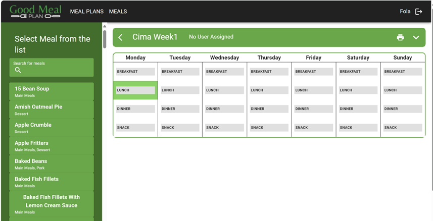
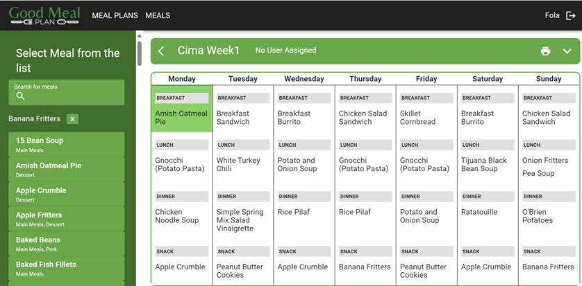

#MealPlanner (GoodMealPlan) Documentation
##Mealplan Calendar
###Overview
The meal plan Calendar  allows users to view a specific meal plan in the desktop view.
###Steps to follow:
1.	Login to GoodMealPlan
2.	Click on meal plan or  create Meal Plan then Enter the meal plan name 'XXX' 
3.	Click on the ‘XXX’ mealplan 
4.	Meal plan name is displayed in tabular form like: 

 
 
*Screenshot: Calendar*

5.	An empty table is shown with 7days (Sunday, Monday, Tuesday, Wednesday, Thursday, Friday) listed and the categories Breakfast, Lunch, Dinner, and Snack are displayed.
6.	Select a meals from the list on the right
7.	Click on the form on the right to insert the meal in the desired meal category. Repeat until you fill up the table. 
 

 
 
*Screenshot: Calendar*
