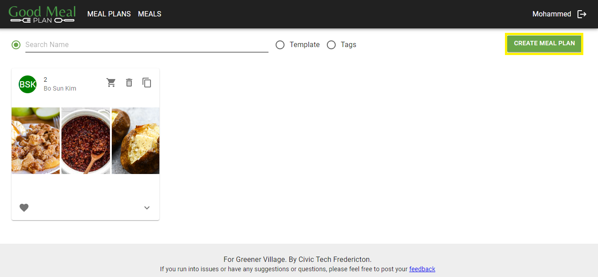
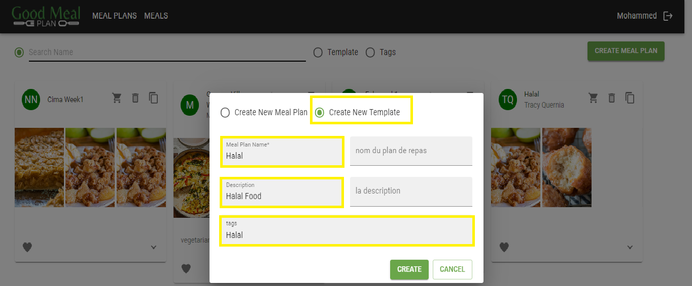
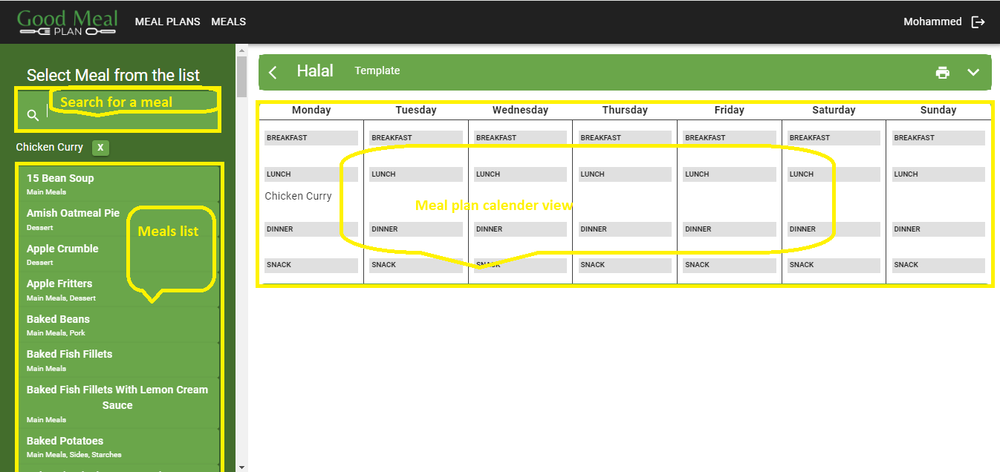

# Create a Meal Template

### Overview
Creating a meal template on GoodMealPlan allows users to define a standardized meal optins that can be reused as needed when creating meal plans. This documentation provides step-by-step instructions on how to create a meal template using the website.

**Usage**

1. **Navigate to the 'Meal Plans' Page**
    - Open your web browser and go to [GoodMealPlan](https://goodmealplan.com/#/mealplans)
    - If you're not already logged in, sign in to your account
    - Once logged in, you'll be directed to the meal plans page
    
2. **Create a New Meal Template**
    - On the meal plans page, click on the "Create Meal Plan" button

*Screenshot 1: Create a New Meal Template*

2. **Enter New Meal Plan Template Information**
    - Select "Create New Meal Template"
    - Provide a name and a description for the meal plan template
    - Add tags based on dietary preferences such as vegetarian, vegan, gluten-free, etc

*Screenshot: Enter Meal Plan Template Information*

4. **Set New Meal Plan Template**
    - Navigate to the 'Meal Plans' page and select the newly created meal plan or any other existing meal plan
    - Navigate to the left side menu and search or browse through the available meal options
    - Click on any meal from the left side menu. In the meal plan calendar view on the right side of the page, click on the desired meal slot (e.g., breakfast, lunch, dinner, snacks)
    - Determine the number of meals/days and repeat the above step accordingly

*Screenshot: Set a Meal Template* 

### Additional Notes
- Complete all required fields marked with *
- You can utilize the print option located at the top right of the page to print meal template details
- For any questions or assistance, please contact your administrator
