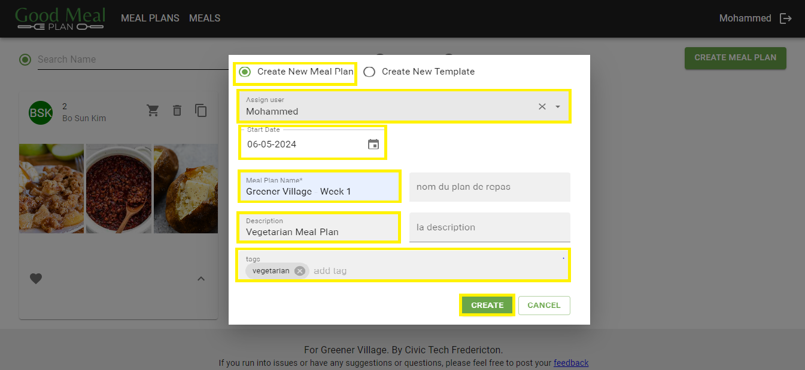
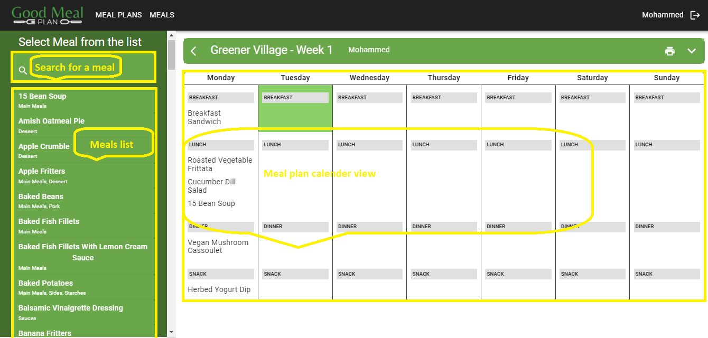

# Create a Meal Plan

### **Overview**
Creating a meal plan on Mealplanner (GoodMealPlan) allows users to generate personalized meal plans based on dietary preferences, nutritional goals, and lifestyle requirements. This documentation provides step-by-step instructions on how to create a meal plan using the website.

**Usage**

1. **Navigate to the 'Meal Plans' Page**
    - Open your web browser and go to [GoodMealPlan](https://goodmealplan.com/#/mealplans)
    - If you're not already logged in, sign in to your account
    - Once logged in, you'll be directed to the meal plans page

2. **Create a New Meal Plan**
    - On the meal plans page, click on the "Create Meal Plan" button

*Screenshot: Create Meal Plan*
         
3. **Enter Meal Plan Information**
    - Select "Create New Meal Plan"
    - From the 'Assign user' dropdown menu, select the user you want to assign to this meal plan
    - In the 'Start date' box, you can select the date when this meal plan takes effect
    - Provide a name and a description for the meal plan
    - Add tags based on dietary preferences such as vegetarian, vegan, gluten-free, etc

*Screenshot: Enter Meal Plan Information*

4. **Set a Meal Plan**
    - Navigate to the 'Meal Plans' page and select the newly created meal plan or any other existing meal plan
    - Navigate to the left side menu and search or browse through the available meal options
    - Click on any meal from the left side menu. In the meal plan calendar view on the right side of the page, click on the desired meal slot (e.g., breakfast, lunch, dinner, snacks)
    - Determine the number of meals/days and repeat the above step accordingly

*Screenshot: Set a Meal Plan* 

### Additional Notes
- Complete all required fields marked with *
- Utilize the print option located at the top right of the page to print meal plan details
- For any questions or assistance, please contact your administrator
