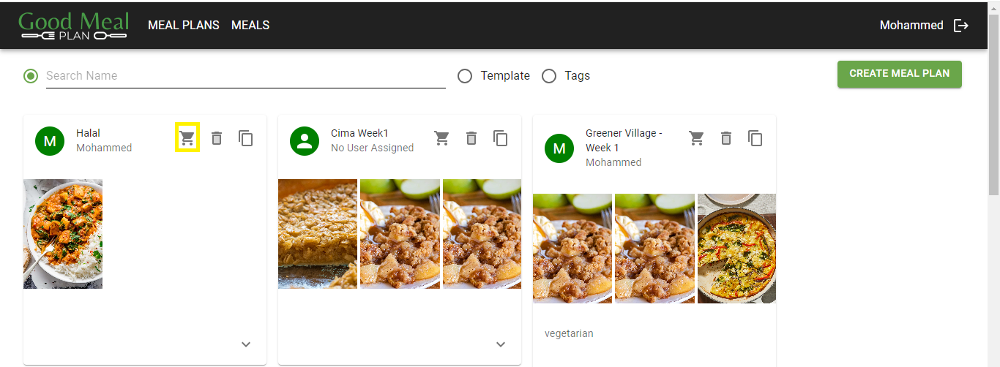

# View the Shopping List of a Meal Plan

## Overview / Disclaimer 
The suggested products are intended to be used as reference for informational purposes only. This is not a recommendation of where to buy. Clients need to research and verify which is suitable to their needs independently. Prices are indicative as per the data procured in March 2024. The prices may vary subject to the time of purchase, store, and mode of purchase.

**Usage**

1. **Navigate to the 'Meal Plans' Page**
    - Open your web browser and go to [GoodMealPlan](https://goodmealplan.com/#/mealplans)
    - If you're not already logged in, sign in to your account
    - Once logged in, you'll be directed to the 'Meal plans' page

2. **View Meal Plan Shopping List**
    - In the "Meal Plans" page, select a meal plan from the available meal plans or use the search option to find a specific meal plan
    - Once you find the desired meal plan, click on the 'Shopping Cart' icon to view the shopping list related to this meal plan

*Screenshot: View Shopping List 1*    

- The shopping list will display the suggested products and items for the meal plan

*Screenshot: View Shopping List 2*

### Additional Notes
- You can use the "Print" option to print your list
- For any questions or assistance, please contact your administrator
